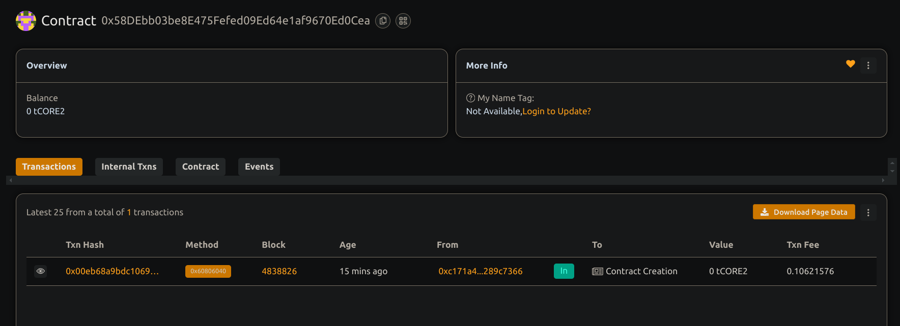

# Digital NFT Minting Platform

## Project Title
Digital NFT Minting Platform for Digital Art

## Project Description
This project implements a streamlined NFT (Non-Fungible Token) minting platform on the Ethereum blockchain focused specifically on digital art. The platform allows artists to easily tokenize their digital creations as unique assets on the blockchain with just a few simple steps.

Built on the ERC-721 standard, the platform provides artists with essential tools to mint, manage and potentially monetize their digital artwork. Each NFT contains metadata pointing to the digital artwork and preserves creator attribution permanently on the blockchain. The platform includes a basic royalty mechanism that ensures artists receive a percentage of secondary sales, providing ongoing revenue streams for creators.

This smart contract serves as the core infrastructure for a complete NFT marketplace ecosystem, handling the critical functions of token minting, creator attribution, and royalty management. The platform balances simplicity with powerful features, making it accessible to artists new to blockchain technology while still providing the functionality needed by experienced creators.

## Project Vision
The vision for this NFT minting platform is to democratize access to the digital art market by providing creators with a simple yet powerful way to tokenize and potentially monetize their work. By reducing technical barriers and simplifying the minting process, we aim to empower artists of all backgrounds to participate in the growing NFT ecosystem.

Our platform addresses key challenges in the traditional art market: attribution, provenance, royalties, and global reach. Through blockchain technology, artists can establish verifiable provenance for their work, receive proper attribution, earn royalties from secondary sales, and reach a global audience without geographical limitations.

The ultimate goal is to create a more equitable digital art ecosystem where creators maintain greater control over their work and receive fair compensation for their creative contributions, all while connecting with collectors and enthusiasts around the world.

## Key Features
- **Simple Minting Process**: Artists can create NFTs with minimal technical knowledge
- **Creator Attribution**: Each NFT permanently records its original creator on the blockchain
- **Configurable Royalties**: Artists can set custom royalty percentages for secondary sales
- **Platform Fee Structure**: Sustainable economic model with transparent fee collection
- **ERC-721 Compliance**: Full compatibility with the broader NFT ecosystem
- **Metadata Support**: Store artwork details and links via standard tokenURI implementation
- **Ownership Management**: Secure transfer and tracking of NFT ownership
- **Royalty Enforcement**: Built-in mechanism to calculate royalty amounts
- **Platform Administration**: Configurable platform fees and recipient management
- **Event Monitoring**: Comprehensive event emission for front-end integration

## Future Scope
- Marketplace Integration – Native platform for listing and purchasing NFTs
- Batch Minting – Mint multiple NFTs in a single transaction
- Collection Management – Group and showcase themed artworks
- Multi-chain Support – Support for Solana, Polygon, and others
- Lazy Minting – Mint on-demand at point of sale
- Fractional Ownership – Share high-value NFTs with multiple owners
- Auction Mechanisms – Timed, Dutch, and English auction models
- Curation Tools – Collections, featured artists, and curated drops
- Social Features – Likes, follows, comments, and shares
- Advanced Metadata – Interactive and multimedia NFT support
- Analytics Dashboard – Insights on engagement and sales
- Mobile Application – Full-feature mobile interface for artists and collectors
- Physical Art Integration – NFTs tied to physical pieces
- DAO Governance – Community-led decision-making and feature rollouts

## Contract details
0x58DEbb03be8E475Fefed09Ed64e1af9670Ed0Cea

